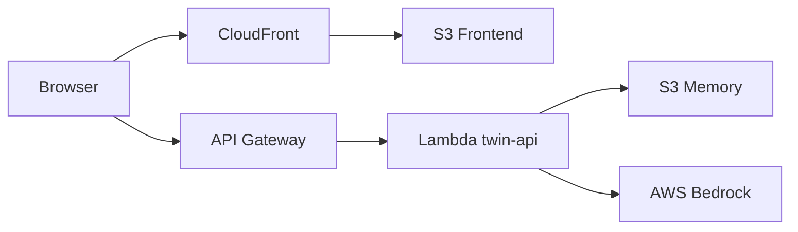

# Digital Twin – AWS Deployment Tutorial

Diese Anleitung beschreibt Schritt für Schritt, wie wir das **Twin-Projekt** auf AWS deployed haben. Sie ist für Junior AI Engineers geschrieben und basiert auf unserem echten Setup.

---

## 1. Was bauen wir?

Ein **AI Digital Twin**: eine Chat-Website, die sich wie du verhält und Fragen zu deinem Profil beantwortet.

**Architektur in einem Satz:**

> Das Frontend (Next.js) liegt statisch auf S3/CloudFront. Das Backend (FastAPI auf Lambda) spricht mit AWS Bedrock für KI-Antworten und speichert Chat-Verläufe in S3.



---

## 2. Projektstruktur (wichtigste Dateien)

```
twin/
├── frontend/                  # Next.js Chat-UI
│   ├── components/twin.tsx    # Chat-Komponente, ruft API auf
│   ├── next.config.ts         # Static Export für S3
│   └── .env.production        # API-URL für Production-Build
├── backend/
│   ├── server.py              # FastAPI App (Bedrock + S3 Memory)
│   ├── lambda_handler.py      # Lambda-Einstiegspunkt (Mangum)
│   ├── context.py             # System-Prompt für den Twin
│   ├── resources.py           # Lädt data/ (LinkedIn, Facts, ...)
│   ├── deploy.py              # Baut lambda-deployment.zip
│   └── .env                   # Lokale Config (Region, Account, ...)
└── data/                      # Personality-Daten für den Twin
    ├── summary.txt
    ├── style.txt
    ├── facts.json
    └── linkedin.pdf
```

---

## 3. Voraussetzungen

Bevor du startest, brauchst du:

- [ ] AWS Account
- [ ] AWS CLI installiert und konfiguriert (`aws configure`)
- [ ] Docker Desktop (für Lambda-Package-Build)
- [ ] Node.js + npm (Frontend)
- [ ] Python + `uv` (Backend)
- [ ] IAM User mit Rechten für Lambda, S3, API Gateway, Bedrock, CloudFront

**Region:** Wir nutzen `eu-central-1` (Frankfurt).

---

## 4. Phase 1 – Lokal entwickeln

### 4.1 Backend lokal starten

```bash
cd backend
uv add -r requirements.txt
uv run uvicorn server:app --reload
```

Backend läuft auf: `http://localhost:8000`

Health-Check:

```bash
curl http://localhost:8000/health
```

### 4.2 Frontend lokal starten

```bash
cd frontend
npm install
npm run dev
```

Frontend läuft auf: `http://localhost:3000`

### 4.3 Was passiert lokal?

- Frontend sendet `POST /chat` an `http://localhost:8000/chat`
- Backend lädt Personality aus `twin/data/`
- Chat-Verlauf wird lokal in `memory/` gespeichert (wenn `USE_S3=false`)
- KI-Antworten kommen von **AWS Bedrock** (nicht mehr OpenAI)

---

## 5. Phase 2 – AWS Ressourcen anlegen

Hier ist, was wir in der AWS Console eingerichtet haben.

### 5.1 Lambda Function: `twin-api`

| Einstellung | Wert |
|---|---|
| Runtime | Python 3.14 |
| Architecture | x86_64 |
| Handler | `lambda_handler.handler` |
| Timeout | 30 Sekunden |
| Memory | 128 MB (kann erhöht werden) |

**Was macht Lambda?**

- Führt unseren FastAPI-Code aus
- `lambda_handler.py` wrapped FastAPI mit **Mangum** für Lambda/API Gateway

```python
# lambda_handler.py
from mangum import Mangum
from server import app

handler = Mangum(app)
```

### 5.2 IAM Rolle für Lambda

Die Execution Role braucht diese Policies:

| Policy | Warum |
|---|---|
| `AWSLambdaBasicExecutionRole` | CloudWatch Logs schreiben |
| `AmazonS3FullAccess` | Chat-Sessions in S3 Memory speichern |
| `AmazonBedrockFullAccess` | Bedrock-Modelle aufrufen |

**Pfad in AWS:** Lambda → twin-api → Configuration → Permissions → Execution role

### 5.3 Lambda Environment Variables

Diese Variablen **musst** du in Lambda setzen:

| Variable | Beispielwert | Erklärung |
|---|---|---|
| `USE_S3` | `true` | Chat-Verlauf in S3 statt lokal |
| `S3_BUCKET` | `twin-memory-722678256685` | **Exakter** Bucket-Name inkl. Account-ID |
| `CORS_ORIGINS` | `https://d2vh7t7kw8r5if.cloudfront.net` | Frontend-URL (keine ARN!) |
| `BEDROCK_MODEL_ID` | `global.amazon.nova-2-lite-v1:0` | Inference Profile, nicht `amazon.nova-lite-v1:0` |
| `DEFAULT_AWS_REGION` | `eu-central-1` | Bedrock-Region |

**Wichtig:**

- Keine Leerzeichen am Ende von Werten!
- `CORS_ORIGINS` = die URL, die Nutzer im Browser sehen (CloudFront-Domain)
- `S3_BUCKET` = Memory-Bucket, **nicht** der Frontend-Bucket

### 5.4 S3 Buckets

Wir nutzen **zwei** Buckets:

| Bucket | Zweck | Beispiel |
|---|---|---|
| Frontend | Statische Website (HTML/JS/CSS) | `twin-frontend-722678256685` |
| Memory | Chat-Sessions als JSON | `twin-memory-722678256685` |

**Frontend-Bucket:**

- Static website hosting aktivieren (oder über CloudFront)
- Öffentlicher Lesezugriff / Bucket Policy für CloudFront

**Memory-Bucket:**

- Privat (nur Lambda-Zugriff)
- Lambda liest/schreibt `{session_id}.json`

### 5.5 API Gateway

- HTTP API (oder REST API) vor Lambda
- Route: `POST /chat` → Lambda `twin-api`
- Route: `GET /health` → Lambda `twin-api`
- CORS in API Gateway kann auf `*` stehen (zusätzlich prüft FastAPI `CORS_ORIGINS`)

**Unsere API-URL:**

```
https://qqk5zui1f0.execute-api.eu-central-1.amazonaws.com
```

### 5.6 CloudFront

- Origin: S3 Frontend Bucket (Website Endpoint)
- Liefert das Frontend unter HTTPS aus
- Beispiel-URL: `https://d2vh7t7kw8r5if.cloudfront.net`

**Warum CloudFront?**

- HTTPS
- Schnellere Auslieferung (CDN)
- Professionelle URL statt roher S3-Website-URL

---

## 6. Phase 3 – Backend deployen (Lambda)

### 6.1 Was macht `deploy.py`?

```bash
cd backend
uv run deploy.py
```

Schritte im Script:

1. Löscht altes `lambda-package/` und `lambda-deployment.zip`
2. Startet **Docker** mit AWS Lambda Python 3.14 Image
3. Installiert Dependencies für **Linux x86_64** (wichtig für pydantic!)
4. Kopiert App-Dateien: `server.py`, `lambda_handler.py`, `context.py`, `resources.py`
5. Kopiert `../data/` in das Package
6. Erstellt `lambda-deployment.zip`

**Warum Docker?**

Packages wie `pydantic_core` haben native Binaries. Wenn du lokal auf dem Mac baust, funktionieren sie in Lambda (Linux) nicht. Docker baut für die richtige Plattform.

### 6.2 Zip zu Lambda hochladen

```bash
cd backend
source .env

DEPLOY_BUCKET="twin-deploy-$(date +%s)"

aws s3 mb s3://$DEPLOY_BUCKET --region $DEFAULT_AWS_REGION
aws s3 cp lambda-deployment.zip s3://$DEPLOY_BUCKET/ --region $DEFAULT_AWS_REGION

aws lambda update-function-code \
    --function-name twin-api \
    --s3-bucket $DEPLOY_BUCKET \
    --s3-key lambda-deployment.zip \
    --region $DEFAULT_AWS_REGION

aws s3 rm s3://$DEPLOY_BUCKET/lambda-deployment.zip
aws s3 rb s3://$DEPLOY_BUCKET
```

**Hinweis:** Du musst im `backend/`-Ordner sein. Kein `cd backend` wenn du schon dort bist.

### 6.3 Backend testen

```bash
curl https://DEINE-API-URL/health
```

Erwartete Antwort:

```json
{
  "status": "healthy",
  "use_s3": true,
  "bedrock_model": "global.amazon.nova-2-lite-v1:0"
}
```

Chat testen:

```bash
curl -X POST https://DEINE-API-URL/chat \
  -H "Content-Type: application/json" \
  -d '{"message":"hello"}'
```

---

## 7. Phase 4 – Frontend deployen (S3 + CloudFront)

### 7.1 Production Build

Erstelle `frontend/.env.production`:

```env
NEXT_PUBLIC_API_URL=https://qqk5zui1f0.execute-api.eu-central-1.amazonaws.com
```

**Wichtig:** Kein `/chat` anhängen – das macht der Code in `twin.tsx` selbst.

```bash
cd frontend
npm run build
```

Das erzeugt den Ordner `frontend/out/` mit statischen Dateien.

### 7.2 Warum „static export“?

In `next.config.ts`:

```typescript
const nextConfig: NextConfig = {
  output: 'export',
  images: { unoptimized: true }
};
```

Das bedeutet:

- Beim Build entstehen fertige HTML/JS/CSS-Dateien
- S3 liefert nur Dateien aus – kein Node.js-Server
- Jeder Deploy ist ein **Snapshot** zum Build-Zeitpunkt
- Code-Änderungen sind erst live nach neuem Build + Upload

### 7.3 Upload nach S3

```bash
aws s3 sync ./out s3://twin-frontend-722678256685/
```

Optional mit Aufräumen alter Dateien:

```bash
aws s3 sync ./out s3://twin-frontend-722678256685/ --delete
```

### 7.4 CloudFront Cache

Nach Upload ggf. CloudFront Invalidation:

```bash
aws cloudfront create-invalidation \
  --distribution-id E196OAERETGWFF \
  --paths "/*"
```

Im Browser: **Hard Reload** (`Cmd+Shift+R`), sonst siehst du altes JavaScript aus dem Cache.

---

## 8. Was im Code wichtig ist

### 8.1 Frontend: API-Aufruf

```typescript
// frontend/components/twin.tsx
const response = await fetch(
  `${process.env.NEXT_PUBLIC_API_URL || 'http://localhost:8000'}/chat`,
  {
    method: 'POST',
    headers: { 'Content-Type': 'application/json' },
    body: JSON.stringify({
      message: input,
      session_id: sessionId || undefined,
    }),
  }
);
```

- Lokal: Fallback auf `localhost:8000`
- Production: URL aus `.env.production`
- `/chat` wird im Code angehängt – nicht in der Env-Variable

### 8.2 Backend: Bedrock-Aufruf

```python
# backend/server.py
response = bedrock_client.converse(
    modelId=BEDROCK_MODEL_ID,
    system=[{"text": prompt()}],      # Personality als System-Prompt
    messages=messages,                 # user/assistant abwechselnd
    inferenceConfig={...}
)
```

**Wichtig:**

- System-Prompt über `system=`, nicht als fake User-Message
- Messages müssen `user` → `assistant` → `user` alternieren
- Modell-ID muss Inference Profile sein: `global.amazon.nova-2-lite-v1:0`

### 8.3 Backend: Memory in S3

```python
# Session wird als {session_id}.json im Memory-Bucket gespeichert
s3_client.get_object(Bucket=S3_BUCKET, Key=f"{session_id}.json")
s3_client.put_object(Bucket=S3_BUCKET, Key=f"{session_id}.json", ...)
```

### 8.4 Personality-Daten

```python
# backend/resources.py
# Lokal: twin/data/
# Lambda: ./data/ (wird von deploy.py mitgepackt)
```

Dateien in `data/`:

- `facts.json` – Name, Rolle, Skills
- `summary.txt` – Kurzprofil
- `style.txt` – Kommunikationsstil
- `linkedin.pdf` – LinkedIn-Profil als Text

---

## 9. Request-Flow (End-to-End)

1. Nutzer öffnet CloudFront-URL
2. Browser lädt statisches Frontend von S3
3. Nutzer tippt Nachricht → `POST /chat` an API Gateway
4. API Gateway ruft Lambda `twin-api` auf
5. Lambda lädt optional Chat-Verlauf aus S3 Memory
6. Lambda baut Prompt aus `context.py` + `data/`
7. Lambda ruft **AWS Bedrock** (`converse`) auf
8. Antwort wird in S3 Memory gespeichert
9. JSON `{ response, session_id }` geht zurück an Browser
10. Frontend zeigt Antwort im Chat

---

## 10. Häufige Fehler (und Lösungen)

| Symptom | Ursache | Fix |
|---|---|---|
| `Could not import module 'server'` | Befehl im falschen Ordner | `cd backend`, dann uvicorn |
| `No module named 'pydantic_core'` | Package für falsche Architektur gebaut | `deploy.py` mit Docker nutzen, Lambda Runtime = Python 3.14, x86_64 |
| `No such file: summary.txt` | `data/` nicht im Lambda-Zip | `deploy.py` kopiert `../data/` – neu deployen |
| `TypeError: Failed to fetch` | Backend nicht erreichbar / CORS | Backend prüfen, `CORS_ORIGINS` setzen |
| `405 Method Not Allowed` | API-URL ohne `/chat` | Frontend neu bauen mit `/chat` im Code |
| `403 Access denied to Bedrock` | Lambda-Rolle ohne Bedrock-Rechte | `AmazonBedrockFullAccess` an Execution Role |
| `400 Invalid message format` | Falsche Modell-ID | `BEDROCK_MODEL_ID=global.amazon.nova-2-lite-v1:0` |
| `AccessDenied` S3 | Falscher Bucket-Name | Exakt `twin-memory-ACCOUNT_ID`, keine Leerzeichen |
| CORS 400 Preflight | CloudFront-ARN statt URL in CORS | `https://xxx.cloudfront.net` setzen |
| Altes Frontend im Browser | Cache | Hard Reload oder CloudFront Invalidation |

---

## 11. Nützliche Debug-Befehle

```bash
# Health check
curl https://DEINE-API-URL/health

# Chat testen
curl -X POST https://DEINE-API-URL/chat \
  -H "Content-Type: application/json" \
  -d '{"message":"hello"}'

# CORS Preflight testen
curl -i -X OPTIONS https://DEINE-API-URL/chat \
  -H "Origin: https://DEINE-CLOUDFRONT-URL" \
  -H "Access-Control-Request-Method: POST" \
  -H "Access-Control-Request-Headers: content-type"

# Lambda Logs (letzte 30 Minuten)
aws logs tail /aws/lambda/twin-api --region eu-central-1 --since 30m

# Lambda Env Vars prüfen (ohne Secrets anzuzeigen)
aws lambda get-function-configuration \
  --function-name twin-api \
  --region eu-central-1 \
  --query 'Environment.Variables.{S3:S3_BUCKET,USE_S3:USE_S3,MODEL:BEDROCK_MODEL_ID,CORS:CORS_ORIGINS}'
```

### HTTP Status Codes – Kurzreferenz

| Code | Bedeutung |
|---|---|
| **200** | OK – alles funktioniert |
| **400** | Bad Request – ungültige Anfrage (z. B. falsche Bedrock Model ID) |
| **403** | Forbidden – keine Berechtigung (IAM, CORS) |
| **405** | Method Not Allowed – falsche URL oder HTTP-Methode |
| **500** | Internal Server Error – Backend ist intern abgestürzt |

---

## 12. Checkliste für jedes Re-Deploy

### Backend geändert?

```bash
cd backend
uv run deploy.py
# ... Lambda upload Befehle (Abschnitt 6.2)
# Env Vars in Lambda prüfen (nicht überschreiben!)
```

### Frontend geändert?

```bash
cd frontend
npm run build
aws s3 sync ./out s3://DEIN-FRONTEND-BUCKET/
# Browser: Cmd+Shift+R
```

### Nur Env Var geändert?

- Kein neues Zip nötig
- In Lambda speichern, 20 Sekunden warten, testen

---

## 13. Unser finales Setup (Referenz)

| Komponente | Wert |
|---|---|
| Lambda | `twin-api` (Python 3.14, x86_64) |
| API Gateway | `https://qqk5zui1f0.execute-api.eu-central-1.amazonaws.com` |
| CloudFront | `https://d2vh7t7kw8r5if.cloudfront.net` |
| S3 Frontend | `twin-frontend-722678256685` |
| S3 Memory | `twin-memory-722678256685` |
| Bedrock Model | `global.amazon.nova-2-lite-v1:0` |
| Region | `eu-central-1` |

---

## 14. Nächste Schritte (optional)

- Custom Domain (Route 53 + ACM Zertifikat)
- Terraform für Infrastructure as Code
- GitHub Actions für automatisches Deploy
- CloudWatch Dashboard für Bedrock/Lambda Metriken
- Secrets in AWS Secrets Manager statt Lambda Env Vars

---

*Erstellt als Lern-Dokumentation für das Twin-Projekt – Stand: Juli 2026*
