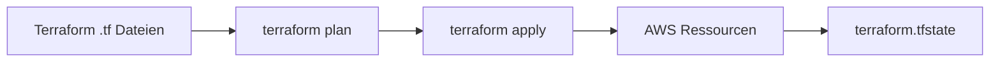

# Tutorial 2: Terraform Deployment auf AWS

Diese Anleitung beschreibt, wie wir das **Twin-Projekt mit Terraform** auf AWS deployen — Schritt für Schritt, für Junior AI Engineers.

> **Voraussetzung:** Du hast das manuelle Setup aus `tutorial.md` verstanden (Lambda, S3, API Gateway, CloudFront). Terraform automatisiert genau das — reproduzierbar und versioniert.

---

## 1. Was ist Terraform hier?

**Terraform** = Infrastructure as Code (IaC)

Statt in der AWS Console zu klicken, beschreibst du deine Infrastruktur in `.tf`-Dateien. Terraform:

1. Liest deine Config
2. Vergleicht mit dem **State** (was schon existiert)
3. Erstellt, ändert oder löscht Ressourcen per `plan` / `apply`



---

## 2. Was Terraform für uns anlegt

| Ressource | Name-Schema (Beispiel dev) |
|-----------|----------------------------|
| S3 Memory Bucket | `twin-dev-memory-722678256685` |
| S3 Frontend Bucket | `twin-dev-frontend-722678256685` |
| Lambda | `twin-dev-api` |
| API Gateway | `twin-dev-api-gateway` |
| CloudFront | z.B. `d7jr57lhiqpl0.cloudfront.net` |
| IAM Role | `twin-dev-lambda-role` |

Alles bekommt das Prefix **`{project_name}-{environment}`** → bei uns `twin-dev`.

---

## 3. Projektstruktur Terraform

```
twin/
├── scripts/
│   ├── deploy.sh          # Vollständiges Deploy (Lambda + TF + Frontend)
│   └── destroy.sh         # Infrastruktur löschen
├── backend/
│   ├── deploy.py          # Baut lambda-deployment.zip (Docker!)
│   └── lambda-deployment.zip
└── terraform/
    ├── main.tf            # Alle AWS-Ressourcen
    ├── variables.tf       # Input-Variablen
    ├── outputs.tf         # URLs nach dem Deploy
    ├── versions.tf        # Provider + Regionen
    ├── terraform.tfvars   # Werte für dev (Standard)
    └── prod.tfvars        # Werte für prod
```

---

## 4. Die wichtigsten Terraform-Dateien

### `versions.tf` — Provider

```hcl
provider "aws" {
  # Nutzt deine AWS CLI Config → meist eu-central-1
}

provider "aws" {
  alias  = "us_east_1"
  region = "us-east-1"
}
```

- **Default-Provider** → fast alles in `eu-central-1`
- **`us_east_1`** → nur für SSL-Zertifikate (ACM) bei Custom Domain (CloudFront-Regel)

### `terraform.tfvars` — Konfiguration für dev

```hcl
project_name             = "twin"
environment              = "dev"
bedrock_model_id         = "global.amazon.nova-2-lite-v1:0"
use_custom_domain        = false
root_domain              = ""
```

### `main.tf` — Lambda (Auszug)

```hcl
resource "aws_lambda_function" "api" {
  filename      = "${path.module}/../backend/lambda-deployment.zip"
  function_name = "${local.name_prefix}-api"
  runtime       = "python3.14"    # MUSS zu deploy.py passen!
  architectures = ["x86_64"]
  handler       = "lambda_handler.handler"

  environment {
    variables = {
      S3_BUCKET        = aws_s3_bucket.memory.id
      USE_S3           = "true"
      BEDROCK_MODEL_ID = var.bedrock_model_id
      CORS_ORIGINS     = "https://${aws_cloudfront_distribution.main.domain_name}"
    }
  }
}
```

Terraform setzt Env Vars **automatisch** — kein manuelles Copy-Paste in der Console.

### `outputs.tf` — URLs nach dem Deploy

```bash
terraform output api_gateway_url
terraform output cloudfront_url
terraform output s3_frontend_bucket
```

---

## 5. Workspaces — dev, test, prod

Terraform **Workspaces** = getrennte Umgebungen mit eigenem State:

| Workspace | Zweck |
|-----------|-------|
| `dev` | Entwicklung / Experimente |
| `test` | Test-Umgebung |
| `prod` | Production |

```bash
terraform workspace list
terraform workspace select dev
terraform workspace new test
```

Jeder Workspace = **eigener Satz AWS-Ressourcen**, keine Überschneidung.

---

## 6. Voraussetzungen

- [ ] AWS CLI konfiguriert (`aws configure`, Region `eu-central-1`)
- [ ] Terraform installiert (`brew install terraform`)
- [ ] Docker Desktop läuft (für `deploy.py`)
- [ ] Node.js + npm (Frontend-Build)
- [ ] Scripts ausführbar:

```bash
chmod +x scripts/deploy.sh scripts/destroy.sh
```

---

## 7. Erstes Deployment (dev)

### Option A: Alles in einem Schritt (empfohlen)

```bash
./scripts/deploy.sh dev
```

Das Script macht:

1. **Lambda-Zip bauen** (`backend/deploy.py` via Docker)
2. **Terraform init + workspace dev**
3. **terraform apply** → AWS-Ressourcen anlegen/aktualisieren
4. **API-URL aus Terraform Output** → `frontend/.env.production`
5. **Frontend bauen** (`npm run build`)
6. **Frontend nach S3 hochladen** (`aws s3 sync`)

Am Ende siehst du:

```
✅ Deployment complete!
🌐 CloudFront URL : https://d7jr57lhiqpl0.cloudfront.net
📡 API Gateway    : https://4vovaoff3f.execute-api.eu-central-1.amazonaws.com
```

### Option B: Nur Terraform (ohne Frontend)

```bash
cd terraform
terraform init
terraform workspace select dev   # oder: terraform workspace new dev
terraform apply -var="project_name=twin" -var="environment=dev"
```

---

## 8. Was `deploy.sh` intern macht

```bash
# 1. Lambda-Package
(cd backend && uv run deploy.py)

# 2. Terraform
cd terraform
terraform init
terraform workspace select dev
terraform apply -var="project_name=twin" -var="environment=dev" -auto-approve

# 3. Frontend
echo "NEXT_PUBLIC_API_URL=$API_URL" > frontend/.env.production
cd frontend && npm run build
aws s3 sync ./out s3://$FRONTEND_BUCKET/ --delete
```

**Wichtig:** Das Script schreibt die API-URL automatisch in `.env.production` — du musst sie nicht manuell setzen.

---

## 9. Production deployen

1. `terraform/prod.tfvars` anpassen (Domain, Modell, Limits)
2. Deploy:

```bash
./scripts/deploy.sh prod
```

Für prod nutzt das Script `-var-file=prod.tfvars`.

**Prod-Besonderheiten** (Standard in `prod.tfvars`):

- `use_custom_domain = true`
- `root_domain = "deine-domain.de"`
- ACM-Zertifikat in `us-east-1` (automatisch via Terraform)

---

## 10. Nur Backend aktualisieren

Wenn du **nur Python-Code** geändert hast:

```bash
cd backend
uv run deploy.py
cd ../terraform
terraform workspace select dev
terraform apply -var="project_name=twin" -var="environment=dev"
```

Terraform erkennt am `source_code_hash` des Zip, dass Lambda aktualisiert werden muss.

Wenn du **nur Env Vars / Runtime** geändert hast (in `main.tf` oder `terraform.tfvars`):

```bash
cd terraform
terraform apply -var="project_name=twin" -var="environment=dev"
```

Kein neues Zip nötig.

---

## 11. Nur Frontend aktualisieren

```bash
cd frontend
npm run build
aws s3 sync ./out s3://twin-dev-frontend-DEINE-ACCOUNT-ID/ --delete
```

Bucket-Name steht in:

```bash
terraform -chdir=terraform output -raw s3_frontend_bucket
```

Danach: **Hard Reload** im Browser (`Cmd+Shift+R`) oder CloudFront Invalidation.

---

## 12. Infrastruktur löschen

```bash
./scripts/destroy.sh dev
```

Das Script:

1. Leert S3-Buckets (Frontend + Memory)
2. Führt `terraform destroy` aus
3. Löscht alle Terraform-Ressourcen für `dev`

Workspace optional entfernen:

```bash
cd terraform
terraform workspace select default
terraform workspace delete dev
```

**Achtung:** `destroy` ist irreversibel — alles weg.

---

## 13. Wichtige Terraform-Befehle

| Befehl | Was es tut |
|--------|------------|
| `terraform init` | Provider installieren, Backend vorbereiten |
| `terraform plan` | Zeigt geplante Änderungen (ohne auszuführen) |
| `terraform apply` | Änderungen anwenden |
| `terraform destroy` | Alles löschen |
| `terraform output` | URLs und Namen ausgeben |
| `terraform workspace list` | Workspaces anzeigen |
| `terraform fmt` | `.tf`-Dateien formatieren |

---

## 14. Kritische Regeln (aus echten Fehlern)

### Regel 1: Python-Version muss übereinstimmen

| Stelle | Wert |
|--------|------|
| `backend/deploy.py` (Docker Image) | `python:3.14` |
| `terraform/main.tf` (`runtime`) | `python3.14` |

**Mismatch →** `No module named 'pydantic_core._pydantic_core'`

### Regel 2: Bedrock Model ID

```hcl
bedrock_model_id = "global.amazon.nova-2-lite-v1:0"
```

**Nicht** `amazon.nova-lite-v1:0` — AWS verlangt Inference Profile mit Prefix (`global.`, `eu.`, `us.`).

### Regel 3: Provider `us_east_1` muss existieren

In `versions.tf` definiert, auch wenn `use_custom_domain = false`. Sonst:

```
Provider configuration not present: aws.us_east_1
```

### Regel 4: `deploy.py` packt `data/` ein

Personality-Dateien liegen in `twin/data/`, nicht in `backend/data/`. `deploy.py` kopiert `../data/`.

### Regel 5: CORS wird automatisch gesetzt

Terraform setzt `CORS_ORIGINS` auf die CloudFront-URL — keine manuelle Lambda-Config nötig (bei Terraform-Deploy).

---

## 15. Fehler-Tabelle

| Symptom | Ursache | Fix |
|---------|---------|-----|
| `Provider configuration not present (us_east_1)` | Provider fehlt in `versions.tf` | `us_east_1` Provider hinzufügen |
| `pydantic_core` Import Error | Runtime ≠ Zip-Python-Version | Beide auf 3.14 |
| `Internal Server Error` (API) | Lambda startet nicht | CloudWatch Logs prüfen |
| `403 Bedrock` | IAM fehlt | Terraform hängt `AmazonBedrockFullAccess` an — apply erneut |
| `400 Bedrock Validation` | Falsche Model ID | `global.amazon.nova-2-lite-v1:0` |
| Chat-Fehler nach TF-Deploy | Altes Frontend im Cache | Hard Reload / Invalidation |
| `Permission denied` auf Script | Nicht ausführbar | `chmod +x scripts/deploy.sh` |

---

## 16. Debug-Befehle

```bash
# Terraform Outputs
terraform -chdir=terraform output

# Lambda Logs
aws logs tail /aws/lambda/twin-dev-api --region eu-central-1 --since 30m

# API testen
curl $(terraform -chdir=terraform output -raw api_gateway_url)/health

# Chat testen
curl -X POST $(terraform -chdir=terraform output -raw api_gateway_url)/chat \
  -H "Content-Type: application/json" \
  -d '{"message":"hello"}'
```

---

## 17. Manuell vs. Terraform — wann was?

| Situation | Empfehlung |
|-----------|------------|
| Erstes Lernen / Debuggen | Manuell (Console) |
| Reproduzierbares Deploy | Terraform |
| Mehrere Umgebungen (dev/prod) | Terraform Workspaces |
| Schneller Code-Fix Lambda | `deploy.py` + `terraform apply` |
| Alles neu deployen | `./scripts/deploy.sh dev` |
| Kosten sparen / Aufräumen | `./scripts/destroy.sh dev` |

Dein manuelles Setup (`twin-api`, alte URLs) und das Terraform-Setup (`twin-dev-api`, neue URLs) können **parallel existieren** — das sind getrennte Stacks.

---

## 18. Typischer Workflow im Alltag

```bash
# 1. Code ändern (backend/server.py oder frontend/twin.tsx)

# 2. Alles deployen
./scripts/deploy.sh dev

# 3. Testen
open $(terraform -chdir=terraform output -raw cloudfront_url)

# 4. Wenn fertig / Kosten sparen
./scripts/destroy.sh dev
```

---

## 19. Checkliste vor dem Deploy

- [ ] Docker läuft
- [ ] `aws sts get-caller-identity` funktioniert
- [ ] `terraform.tfvars` / `prod.tfvars` geprüft
- [ ] `runtime` in `main.tf` = Python-Version in `deploy.py`
- [ ] `bedrock_model_id` mit `global.` Prefix
- [ ] Scripts ausführbar (`chmod +x`)

---

## 20. Unser dev-Setup (Referenz)

Nach erfolgreichem `./scripts/deploy.sh dev`:

| Output | Beispielwert |
|--------|--------------|
| CloudFront | `https://d7jr57lhiqpl0.cloudfront.net` |
| API Gateway | `https://4vovaoff3f.execute-api.eu-central-1.amazonaws.com` |
| Lambda | `twin-dev-api` |
| S3 Frontend | `twin-dev-frontend-722678256685` |
| S3 Memory | `twin-dev-memory-722678256685` |

---

*Erstellt als Terraform-Lern-Dokumentation für das Twin-Projekt — Stand: Juli 2026*
